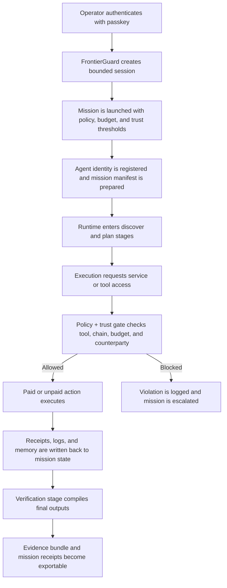
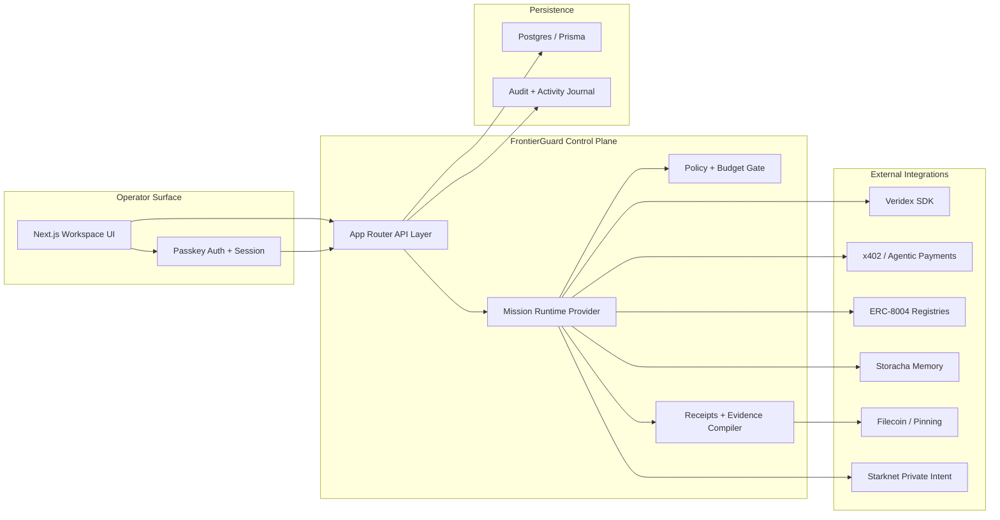

# Veridex FrontierGuard

**Portable trust. Bounded autonomy. Verifiable execution.**

Veridex FrontierGuard is an operator workspace for launching, monitoring, and verifying autonomous missions.

It combines passkey-based operator control, bounded execution policies, machine payments, portable agent identity, and durable evidence into a single control plane that both humans and agents can use.

## Overview

Autonomous systems are getting better at planning and acting, but most production environments still lack four things:

- clear operator authorization
- hard execution boundaries
- trustworthy payment and service access
- receipts that survive after the task is done

FrontierGuard addresses that gap with one workflow:

1. an operator authenticates with a passkey
2. a mission is launched with explicit budget and policy constraints
3. the runtime discovers and executes task steps
4. paid actions are routed through x402-compatible payment flows
5. identity and feedback are attached through ERC-8004
6. logs, memory, and evidence are retained as exportable artifacts

The result is a control plane that feels like a business product, not a loose collection of protocol demos.

## What The Product Does

### Core capabilities

- **Passkey operator auth**
  Creates a durable operator session without introducing password management overhead.
- **Bounded mission launch**
  Missions are created with scope, budget, trust thresholds, tool limits, and chain limits.
- **Execution control**
  The system tracks mission stages from authorization through final verification.
- **Paid service access**
  Premium services can require payment before returning high-value data or execution results.
- **Portable trust**
  Agent identity and feedback are represented with ERC-8004-compatible records and receipts.
- **Evidence vault**
  The system groups receipts, manifests, logs, memory, and exportable mission artifacts in one place.
- **Machine access**
  Agent-friendly endpoints are exposed for discovery, payment, and runtime interoperability.

### Supporting rails

The main operating surface centers on the immediate execution path. Additional rails are implemented as supporting modules:

- **Starknet** for private intent commitments
- **Filecoin** for durable evidence anchoring
- **Storacha** for shared mission memory
- **Flow** for scheduled execution
- **Zama** for confidential policy paths

These are intentionally secondary to the core trust-and-execution loop.

## User Experience

FrontierGuard is designed as a desktop-first enterprise workspace with a consistent operator shell.

### Main workflow

- **Login**
  Authenticate with a passkey and establish an operator session.
- **Overview**
  Inspect mission health, readiness, trust state, and recent activity.
- **Launch**
  Define the mission, constraints, budget, and execution mode.
- **Execution**
  Observe live stage progression, current tasks, incidents, and payment activity.
- **Receipts**
  Inspect payment receipts, identity proofs, and evidence artifacts.
- **Settings**
  Review runtime readiness, machine-access endpoints, and integration status.

## How It Works

### Mission lifecycle



### System architecture



## Architecture

### Frontend

- **Next.js App Router**
  Drives the operator workspace, mission screens, and API routes.
- **Shared Frontier shell**
  Provides consistent navigation, status surfaces, and authenticated workspace behavior.
- **Mission runtime provider**
  Maintains operator state, mission state, logs, artifacts, and stage progression.

### Backend

- **App Router API routes**
  Handle passkey auth, mission persistence, status checks, payments, and integration calls.
- **Repository layer**
  Persists mission, auth, audit, payment, and evidence records.
- **Integration modules**
  Encapsulate protocol-specific behavior for x402, ERC-8004, Starknet, Storacha, and Filecoin.

### Persistence

- **Postgres**
  Stores credentials, sessions, mission snapshots, evidence metadata, and audit history.
- **Prisma**
  Defines schema and migrations for the app’s durable records.

## Key Components

| Area | Responsibility |
|---|---|
| `src/app` | UI routes and API routes |
| `src/components/frontierguard` | Shared shell, auth context, runtime provider, status hooks |
| `src/lib/frontierguard` | Types, mission state, integrations, repository helpers |
| `prisma` | Database schema and migrations |
| `scripts/base-sepolia-wallet.mjs` | Utility for generating or deriving a Base Sepolia signer |

## Protocol Integrations

### Veridex SDK

Used for passkey credential handling and operator-side identity/session foundations.

### Agentic Payments / x402

Used to handle machine-payment flows for premium services and payment-gated execution.

### ERC-8004

Used to register agent identity and attach post-mission feedback to a portable trust surface.

### Storacha

Used for shared memory and mission handoff state.

### Filecoin

Used for evidence pinning and durable artifact linkage.

### Starknet

Used for private-intent commitments in the secondary privacy rail.

## Data Model

FrontierGuard persists more than just the latest mission snapshot. The system also records:

- passkey credentials
- auth sessions
- mission state
- evidence artifacts
- memory records
- agent registrations
- feedback events
- audit events
- payment events
- policy evaluations
- tool invocations
- runtime errors
- disputes and resolutions
- state versions and operator actions

This is what makes the control plane reviewable after the task completes.

## Machine-Readable Endpoints

The app exposes endpoints that agents or runtime clients can consume directly:

- `/.well-known/agent-registration.json`
- `/.well-known/ucp`
- `/.well-known/acp-checkout`
- `/.well-known/ap2-mandate`
- `/api/frontier/agent/premium-yield`
- `/api/frontier/status`

These endpoints are also surfaced inside the settings screen so operators can inspect what is available.

## Local Development

### Requirements

- `bun`
- `node`
- `postgres`

### Install

```bash
cd /Users/mannyuncharted/Documents/gigs/veridex/hackathon/plgenesis
bun install
```

### Configure environment

```bash
cp .env.example .env.local
```

### Generate Prisma client and apply migrations

```bash
bunx prisma generate
bunx prisma migrate deploy
```

### Start the app

```bash
bun run dev
```

### Build for production

```bash
bun run build
```


## Scripts

| Command | Purpose |
|---|---|
| `bun run dev` | Start the local development server |
| `bun run build` | Build the production app |
| `bun run start` | Start the production server |
| `bun run lint` | Run ESLint |
| `bun run wallet:base-sepolia` | Generate or derive Base Sepolia signer values |
| `bun run prisma:generate` | Generate Prisma client |
| `bun run prisma:migrate:deploy` | Apply migrations |
| `bun run prisma:migrate:status` | Check migration status |


## Status

FrontierGuard is implemented as a real application, not just a design mock:

- the operator UI is functional
- passkey auth and session persistence are wired
- mission state is persisted
- receipts and audit records are stored
- protocol integrations exist for the primary trust-and-payment path

The default repo does **not** ship fully live credentials. To run the full testnet proof path, the required Base Sepolia and relayer configuration must be supplied through `.env.local`.
