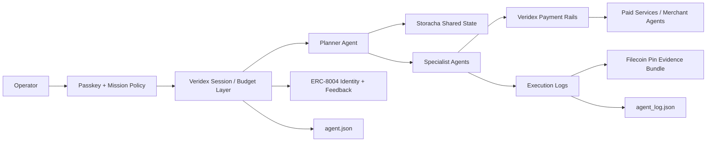

# PRD: Veridex FrontierGuard Network

## 1. Document Status

- **Status:** Hackathon submission PRD
- **Working deadline:** March 31, 2026
- **Submission type:** Existing Code
- **Goal:** Ship one flagship submission that can qualify for multiple PL_Genesis bounties

## 2. Product Definition

Veridex FrontierGuard Network is a trust and execution control plane for autonomous agents.

It combines:

- passkey-based bounded delegation
- multi-protocol machine payments
- portable onchain agent identity
- shared multi-agent memory
- durable execution evidence

The product lets a human operator launch an agent that can autonomously discover, plan, pay, execute, verify, and return receipts, while staying inside strict policy limits.

## 3. Problem

Autonomous agents are becoming capable of executing real work, but high-stakes adoption is blocked by five gaps:

1. Agents do not have portable, verifiable identities.
2. Agents do not have safe access to money.
3. Agents cannot easily coordinate through shared user-owned memory.
4. Execution logs are often ad hoc and not durable.
5. Operators cannot easily prove what the agent did and why.

The result is that agents can look impressive in demos but remain too risky for treasury, research, operations, or infrastructure workflows.

## 4. Solution

FrontierGuard solves this by combining:

### 4.1 Veridex Delegation Layer

- passkey-based operator authorization
- bounded session keys
- per-task and per-day budgets
- chain / tool / counterparty restrictions

### 4.2 Veridex Payment Layer

- x402 / UCP / ACP / AP2 compatible payment routing
- autonomous fetch-and-pay flows
- machine-usable payment authorization

### 4.3 ERC-8004 Trust Layer

- agent identity registration
- receipts and reputation feedback
- machine-readable manifests

### 4.4 Storacha Memory Layer

- shared task state between agents
- portable memory across runs
- delegation-friendly access model

### 4.5 Filecoin Evidence Layer

- pinned agent manifests
- pinned execution bundles
- durable retrieval for dispute and review

## 5. Product Thesis

The winning submission is not “an agent.”

It is the infrastructure that makes agents:

- attributable
- payable
- coordinated
- auditable

That makes FrontierGuard legible across crypto, infrastructure, AI, and trust-centric bounty categories without fragmenting the story.

## 6. Target Users

### Primary Users

- protocol teams
- DAO treasury operators
- AI-native fintech teams
- multi-agent application developers
- infrastructure teams running autonomous workflows

### Secondary Users

- researchers who need paid data access and evidence trails
- operators who need portable trust for service-discoverable agents

## 7. Primary Use Cases

### Use Case 1: Autonomous Research Procurement

An operator launches a research agent with a capped budget. The agent discovers premium APIs, purchases required inputs, coordinates with specialist agents, and returns a report plus receipts.

### Use Case 2: Trust-Gated Agent Collaboration

A planner agent discovers external specialist agents and only transacts with those that satisfy trust and policy thresholds.

### Use Case 3: Durable Mission Audit

An operator needs to inspect exactly what the agent did, what it paid for, what failed, and what evidence exists.

## 8. Bounty Positioning

### P0 Targets

- Existing Code
- Agents With Receipts — 8004
- Agent Only : Let the agent cook
- Filecoin
- Storacha

### P1 Targets

- AI & Robotics
- Infrastructure & Digital Rights
- Crypto
- Community Vote

### P2 Stretch

- Hypercerts

## 9. Current-State vs Hackathon-State

### Current Veridex Strengths

- passkey identity
- session keys
- multi-protocol agent payments
- cross-chain support
- enterprise trust and trace demo surfaces

### Hackathon MVP Must Add

- real ERC-8004 registration
- real ERC-8004 feedback flow
- `agent.json`
- `agent_log.json`
- Filecoin Pin integration
- Storacha memory integration
- one polished end-to-end autonomous mission

### Future State, Not Required For Submission

- full cross-chain reputation aggregation
- advanced validation networks
- broader impact attestation layer

## 10. Feature Set

### 10.1 Mission Launch

The operator can:

- define mission goal
- set mission budget
- set expiry
- define allowed tools and services
- define escalation threshold
- authorize via passkey

### 10.2 Capability Manifest

The system generates `agent.json` containing:

- agent name
- operator wallet
- ERC-8004 identity
- supported tools
- supported chains
- compute limits
- task categories

### 10.3 Autonomous Mission Loop

The agent system must complete:

1. discover
2. plan
3. execute
4. verify
5. finalize

### 10.4 Structured Execution Logging

The system generates `agent_log.json` with:

- decisions
- tool calls
- retries
- failures
- outputs
- payment events
- final status

### 10.5 Payment-Gated Tool Use

The system can:

- hit a paid endpoint
- detect payment requirements
- authorize payment inside bounds
- retry the request automatically

### 10.6 Shared Memory

The system stores:

- task queue
- partial outputs
- handoff records
- mission summaries

on Storacha so multiple agents can collaborate.

### 10.7 Portable Trust

The system:

- registers agent identity on ERC-8004
- stores registration metadata
- posts reputation / feedback after successful mission steps

### 10.8 Evidence Bundle

The system pins:

- agent manifest
- mission summary
- structured logs
- receipt bundle

through Filecoin Pin so the mission can be inspected later.

## 11. User Stories

### Operator

As an operator, I want to launch an agent with a clear budget and policy, so that it can act autonomously without uncontrolled risk.

### Planner Agent

As a planner agent, I want access to shared task state and trusted service discovery, so that I can coordinate work intelligently.

### Specialist Agent

As a specialist agent, I want to pay for the tools I need inside approved limits, so that I can complete my task without human intervention.

### Auditor Agent

As an auditor agent, I want structured logs and durable evidence, so that I can validate outcomes and produce receipts.

## 12. Functional Requirements

### Requirement 1: Bounded Delegation

The system shall:

- create a mission-scoped session
- enforce spending limits
- enforce expiry
- enforce allowed targets
- allow operator revocation

### Requirement 2: Manifest Generation

The system shall:

- generate `agent.json`
- include machine-readable capabilities
- include ERC-8004 identity reference

### Requirement 3: Autonomous Execution

The system shall:

- decompose at least one mission autonomously
- execute multiple steps without human intervention after launch
- handle at least one recoverable failure path

### Requirement 4: Tool / Payment Use

The system shall:

- interact with at least one real paid or payment-gated endpoint
- authorize payment using Veridex rails
- record the payment event in the mission log

### Requirement 5: Shared Memory

The system shall:

- write structured mission state to Storacha
- allow a second agent role to consume that state

### Requirement 6: Portable Trust

The system shall:

- register the agent on ERC-8004
- emit at least one trust or feedback interaction

### Requirement 7: Durable Evidence

The system shall:

- pin manifest and mission artifacts through Filecoin Pin
- surface resulting content references in the operator UI or final report

### Requirement 8: Receipts

The system shall:

- output `agent_log.json`
- output a mission summary
- output proof links or tx references for trust and evidence steps

## 13. Non-Goals

The hackathon MVP will not attempt to:

- support every sponsor track equally
- deploy a full production validator network
- solve advanced cryptographic trace attestation
- launch a full marketplace economy
- support every external framework deeply

## 14. UX Requirements

The demo UX must be understandable in under two minutes.

### Required Screens

1. Mission Launch
2. Live Mission Run
3. Shared State / Handoff View
4. Receipts / Evidence View
5. Agent Trust Profile

### Demo Simplicity Principle

One excellent mission flow beats five partial ones.

## 15. Technical Architecture

## 15.1 Reused Surfaces

- `enterprise_demo/` for operator console, trust and incident lineage
- `veri_agent/` for autonomous orchestration shell
- Veridex SDK / contracts for passkeys, payments, and relay logic

### 15.2 New Hackathon Modules

- `erc8004/` integration layer
- `agent.json` builder
- `agent_log.json` emitter
- Filecoin Pin publisher
- Storacha state adapter
- mission coordinator

### 15.3 Logical Architecture

## 16. Demo Scenario

### Recommended Scenario

**Autonomous frontier research mission**

Prompt:

> Research the safest stablecoin yield route, purchase required premium data, compare options, and return a recommendation with receipts.

Why this scenario:

- naturally uses machine payments
- naturally benefits from trust and receipts
- fits AI, crypto, and infrastructure themes
- avoids fake robotics gimmicks

## 17. Success Metrics

### Submission Success

- qualifies for at least 5 compatible bounties
- has one coherent story across all selected bounties
- live demo runs end to end

### Product Success

- operator can launch agent in under 2 minutes
- mission completes without manual intervention after launch
- logs and manifests are machine-readable
- evidence bundle is retrievable

### Judging Success

- judges can clearly see what is new
- judges can verify onchain trust actions
- judges can understand why the infrastructure matters

## 18. Risks

### Risk 1: Over-scope

**Mitigation:** lock to one flagship mission and one flagship trust flow

### Risk 2: Sponsor Drift

**Mitigation:** optimize for the highest-overlap stack rather than chasing every sponsor

### Risk 3: Overclaiming

**Mitigation:** distinguish clearly between:

- real shipped behavior
- demo-only behavior
- future roadmap behavior

### Risk 4: Integration Friction

**Mitigation:** use the simplest valid version of Filecoin and Storacha integrations that still satisfy bounty requirements

## 19. Delivery Plan Through March 31, 2026

### Phase 1: March 13-17

- lock concept and bounty stack
- implement `agent.json`
- implement `agent_log.json`
- define final demo scenario

### Phase 2: March 18-22

- integrate ERC-8004 registration
- integrate ERC-8004 feedback
- show identity and receipt objects in UI

### Phase 3: March 23-26

- integrate Filecoin Pin for mission artifacts
- integrate Storacha for shared task state
- connect both to the live mission flow

### Phase 4: March 27-29

- polish operator console
- harden logs and receipts
- record dry-run demo videos

### Phase 5: March 30-31

- finalize submission copy
- record final demo
- publish community post / thread
- submit all selected bounty qualifications

## 20. Submission Checklist

### Core

- [ ] public repo or submission-ready code state
- [ ] working demo
- [ ] short video
- [ ] summary
- [ ] architecture explanation

### Agent Tracks

- [ ] `agent.json`
- [ ] `agent_log.json`
- [ ] autonomous loop
- [ ] safety / guardrails
- [ ] verifiable trust transactions

### Filecoin

- [ ] meaningful Filecoin Pin usage
- [ ] Calibration-linked component or proof
- [ ] evidence retrieval shown in demo

### Storacha

- [ ] shared state on Storacha
- [ ] multi-agent handoff in demo

### Community Vote

- [ ] X thread or post
- [ ] tags and hashtag included
- [ ] clear sponsor and focus-area callouts

## 21. Final Recommendation

Ship **Veridex FrontierGuard Network** as the flagship `Existing Code` submission.

The build should prioritize:

1. autonomous execution
2. ERC-8004 identity and receipts
3. Filecoin-backed evidence
4. Storacha-backed collaboration

That combination gives Veridex the clearest path to the highest total upside while staying true to the strongest capabilities already present in the repo.
