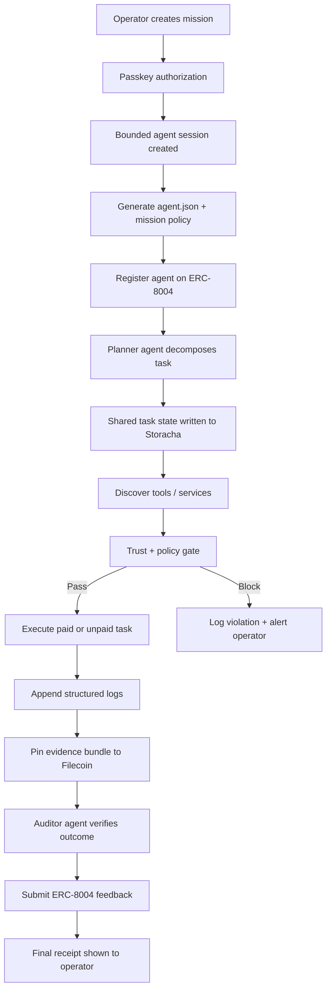

# Updated User Flow

## Product Name

`Veridex FrontierGuard Network`

## Core User Promise

An operator can launch an autonomous agent that:

- has a portable trust identity
- can pay for services safely
- can collaborate with other agents
- can retain shared memory across runs
- can produce reviewable evidence and receipts

## Primary Personas

### 1. Operator

The human who configures the mission, signs delegation, and reviews outcomes.

### 2. Planner Agent

Breaks the mission into sub-tasks and decides what specialist capabilities are needed.

### 3. Specialist Agent

Executes paid or unpaid sub-tasks within policy limits.

### 4. Auditor Agent

Checks outputs, compiles receipts, and posts trust feedback.

### 5. External Service / Merchant Agent

Offers data, compute, or execution behind a paid endpoint.

## End-to-End Flow

### Flow A: Mission Launch

1. Operator opens the FrontierGuard console.
2. Operator chooses a mission template or writes a new mission.
3. Operator defines:
   - budget
   - expiry
   - allowed tools
   - allowed chains
   - allowed counterparties
   - escalation threshold
4. Operator authorizes the mission with a passkey.
5. The system creates a bounded agent session.
6. The system generates and stores:
   - `agent.json`
   - session policy object
   - initial mission record
7. The system registers the agent on ERC-8004.
8. The registration file is published and pinned.

### Flow B: Autonomous Planning

1. Planner agent reads the mission.
2. Planner agent checks existing shared memory and prior mission state.
3. Planner agent breaks the mission into sub-tasks.
4. Planner agent decides whether it can complete tasks itself or should delegate to specialists.
5. The plan is written to shared Storacha state.

### Flow C: Service Discovery + Trust Check

1. Planner agent discovers internal or external service endpoints.
2. The system resolves the counterparty's identity when available.
3. The trust gate checks:
   - whether the service is allowed by policy
   - whether the counterparty meets the minimum trust threshold
   - whether enough budget remains
4. If the action fails policy:
   - block immediately
   - write reason to `agent_log.json`
   - surface alert to operator if needed
5. If the action passes:
   - continue to execution

### Flow D: Execution + Payment

1. Specialist agent requests a paid service.
2. Merchant returns payment requirements.
3. Veridex handles protocol detection and bounded payment authorization.
4. The agent pays only if:
   - payment is within budget
   - counterparty is acceptable
   - chain / asset / tool constraints match policy
5. The service responds with task output.
6. The result is written to shared Storacha state.

### Flow E: Logging + Evidence

1. Each major step appends a structured event to `agent_log.json`.
2. The system records:
   - decision
   - tool call
   - payment details
   - retries
   - failure reasons
   - final output
3. Mission artifacts are bundled.
4. The bundle is pinned to Filecoin Pin.
5. The system stores the resulting content identifiers in the mission record.

### Flow F: Verification + Receipts

1. Auditor agent evaluates mission output and execution history.
2. Auditor agent checks whether:
   - mission objective was satisfied
   - policies were respected
   - outputs are internally consistent
3. Auditor agent prepares:
   - execution summary
   - receipt bundle
   - final mission status
4. The system submits post-task reputation / feedback to ERC-8004.
5. Operator receives a final mission receipt and can inspect evidence.

## Error and Escalation Flow

### When Policy Is Violated

1. Proposed action is blocked before execution.
2. A structured violation record is appended to `agent_log.json`.
3. The console shows:
   - blocked action
   - violated policy
   - recommended next step
4. Operator can:
   - dismiss
   - override and relaunch with a broader mandate
   - revoke the mission entirely

### When The Agent Fails But Can Recover

1. The failure is logged.
2. The planner agent retries or reroutes.
3. Retry count is limited by budget and compute policy.
4. Recovery attempt is logged as a new execution event.

### When The Counterparty Is Untrusted

1. The trust gate rejects the payment.
2. The planner agent seeks an alternative service.
3. The operator only gets involved if no safe route exists.

## UX Surface

### Core Screens

1. Mission Launch
2. Active Mission View
3. Agent Trust Profile
4. Shared Memory / Task Board
5. Execution Log Viewer
6. Receipts + Evidence View
7. Dispute / Incident Review

## Visual Workflow

## Example Mission Walkthrough

### Mission

“Research the safest stablecoin yield route for treasury funds, buy the required premium market data, compare three options, and return a recommendation with receipts.”

### Example Run

1. Operator allocates a $25 budget and a 2-hour expiry.
2. Planner agent breaks the job into:
   - market data acquisition
   - protocol risk comparison
   - recommendation synthesis
3. Specialist agent purchases premium market data from an x402 endpoint.
4. Shared state is written to Storacha for downstream specialists.
5. Auditor agent validates that purchases stayed within policy.
6. Evidence bundle and logs are pinned.
7. ERC-8004 feedback is posted for the service interaction.
8. Operator sees the recommendation, cost breakdown, and receipts.

## MVP Flow Boundaries

### Must Be Real In The Hackathon Version

- passkey-scoped launch
- autonomous planning and execution
- payment-gated service access
- ERC-8004 identity + feedback
- `agent.json`
- `agent_log.json`
- Storacha shared state
- Filecoin-backed evidence bundle

### Can Be Simpler In MVP

- trust scoring can be threshold-based, not fully sophisticated
- memory retrieval can be a small set of structured records
- only one mission template has to be fully polished

## Success Criteria For The User Flow

The flow is successful if a judge can understand this sequence in under two minutes:

1. human authorizes agent
2. agent runs autonomously
3. payments happen safely
4. memory is shared across agents
5. identity and receipts are onchain
6. evidence is durable and inspectable
